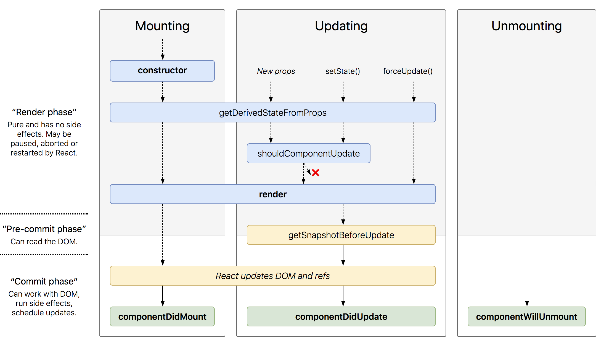

#### DEMO: Single Page Application - Room Management

**Event**
```html
<button
  onClick={e => {
    const { rooms } = this.state || this.props;
    const newRooms = [...rooms];
    console.log(e);
    // console.log(e.nativeEvent);
    newRooms.splice(i, 1);
    this.setState({ rooms: newRooms });
  }}
>
  Delete
</button>
```

**Class Component Life cycle**

 Life-cycle Methods [Details](https://reactjs.org/docs/react-component.html#static-getderivedstatefromprops).



**Context**

Define Context object
```js
const ThemeContext = React.createContext({
  theme: "dark",
  changeTheme: () => {}
});
```

Wrap components that will consume the Context
```html
<ThemeContext.Provider
  value={{ theme: this.state.theme, changeTheme: this.changeTheme }}
>
  <ThemeSelect />
  <RoomList key="list" rooms={RoomData.rooms} />
</ThemeContext.Provider>
```

Consume Context in target descendant components
```html
<ThemeContext.Consumer>
  {({theme, changeTheme}) => {
    return (
      <select onChange={changeTheme} value={theme}>
        <option value="dark">Dark</option>
        <option value="green">Green</option>
      </select>
    );
  }}
</ThemeContext.Consumer>
```

**React Router**
```bash
npm install react-router-dom
```
Run up a web site with Express
```bash
npm install express
```
```js
const express = require('express');
const app = express();

const port = 8080;

app.get('/login', (req,res) => {
    return res.send('login page');
});

app.listen(port, () => console.log(`App listening on port ${port}!`))
```

##### Components in React Router
1. Router
```html
<!-- Router is charge for navigation management,  it must be placed at most top node in a page --> 
<Router>
      <!-- place your ui components here -->    
      
</Router>
```
2. Link
```html
<!--Link is for page navigation, it is like a native <a>link</a> element --> 
<Link to="/home">
      <!-- place your ui components here -->    
      
</Link>

<!--it is a extended Link component, support active status --> 
<NavLink to="/home">
      <!-- place your ui components here -->    
      
</NavLink>
```
3. Route
```html
<!-- render corresponding component by path matching --> 
<Route path="/rooms" component={RoomList} />
```

**High Order Component**

A higher-order component (HOC) is an advanced technique in React for reusing component logic. 

```js
// Wrapper method accept a component as input, and output a new component which called HOC.
const Wrapper = Inner => {
  class AuthWrapper extends BaseComponent {
    // constructor(props, context) {
    //   super(props, context);
    // }

    render() {
      if (!this.context.data.auth) {
        return <Redirect to="/login" />;
      }

      return <Inner {...this.props} />;
    }
  }

  return AuthWrapper;
};

const HighOrderComponent = Wrapper(InnerComponent);

export default HighOrderComponent;
```
